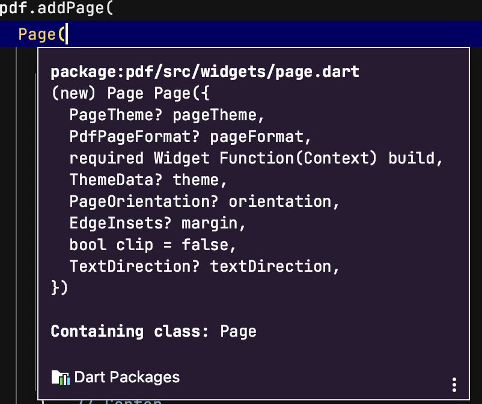
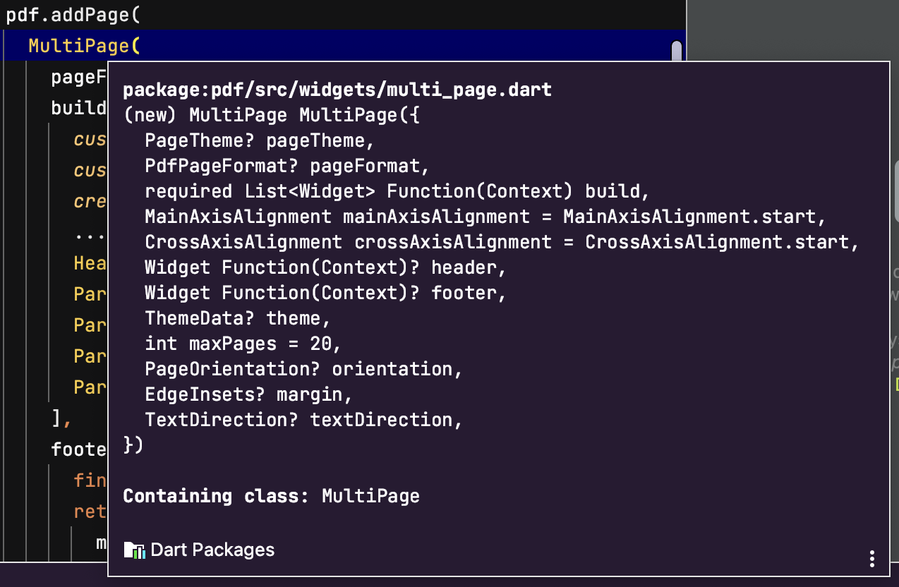
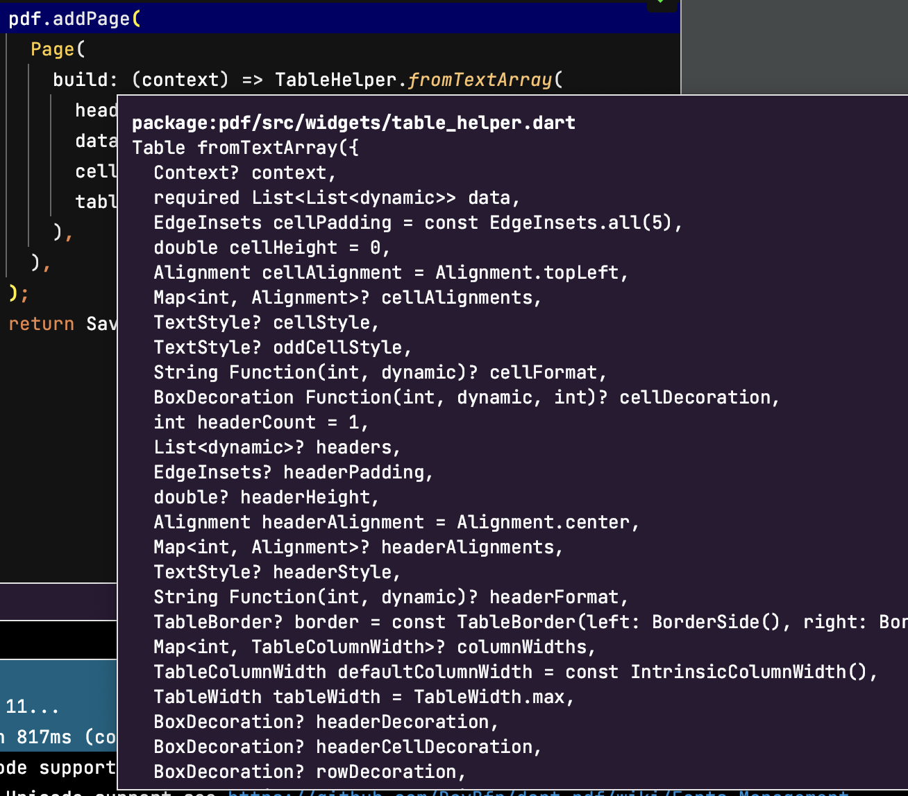

# pdf_package_flutter

A new Flutter project.

## Getting Started

This project is a starting point for a Flutter application.

A few resources to get you started if this is your first Flutter project:

- [Lab: Write your first Flutter app](https://docs.flutter.dev/get-started/codelab)
- [Cookbook: Useful Flutter samples](https://docs.flutter.dev/cookbook)

For help getting started with Flutter development, view the
[online documentation](https://docs.flutter.dev/), which offers tutorials,
samples, guidance on mobile development, and a full API reference.

## 1. Research: Pdf Package Flutter

- Keywords:
    - pdf package flutter
    - pdf flutter package
    - pdf flutter example
    - flutter pdf viewer
    - create pdf flutter
    - convert widget to pdf flutter
    - flutter pdf viewer example
    - flutter full pdf viewer
    - pdf generator flutter
    - flutter pdf multipage
    - create pdf in flutter example
    - flutter pdf download
    - flutter document viewer
    - text to pdf flutter
    - flutter pdf generator
    - best flutter pdf viewer
    - flutter view pdf
    - pdf viewer flutter github
- Video Title: Flutter Pdf Package | How to create/generate pdf files in Flutter using Pdf Package

## 2. Research: Competitors

**Flutter Videos/Articles**

- 3.4K: https://youtu.be/EQKPwKCLfws
- 66K: https://youtu.be/z_5xkhEkc5Y
- 17K: https://youtu.be/9nhZO88p1lY
- 138: https://youtu.be/8hhd2KmqQHE
- 18K: https://youtu.be/6bYG-JwnoO4
- 6.9K: https://youtu.be/QORhfh8EIHY
- 3.1K: https://youtu.be/hIHrCdLEVoc
- https://pub.dev/packages/pdf
- https://blog.logrocket.com/how-create-pdfs-flutter/
- https://lakshydeep-14.medium.com/30-flutter-tips-ft11-create-view-print-download-pdf-in-flutter-2a903b945164
- https://maneesha-erandi.medium.com/pdf-creation-with-flutter-bac7e2753b8
- https://www.google.com/search?q=pdf+package+flutter

**Android/Swift/React Videos**

- https://www.baeldung.com/java-pdf-creation
- https://www.javatpoint.com/java-create-pdf
- https://www.vogella.com/tutorials/JavaPDF/article.html
- https://betterprogramming.pub/swift-generating-pdfs-dynamically-using-pdfkit-12c37168e106
- https://www.kodeco.com/4023941-creating-a-pdf-in-swift-with-pdfkit
- https://pspdfkit.com/blog/2019/creating-pdf-in-swift/
- https://upplabs.com/blog/how-to-generate-a-pdf-document-in-a-react-native-project
- https://pspdfkit.com/guides/react-native/pdf-generation/
- https://dev.to/jaamaalxyz/how-to-generate-pdf-from-html-in-react-native-oj0
- https://www.npmjs.com/package/react-native-html-to-pdf
- https://www.nicesnippets.com/blog/how-to-generate-pdf-file-in-react-native
- https://www.bam.tech/en/article/the-tech-news
- https://aboutreact.com/make-pdf-in-react-native-from-html-text/
- 80K: https://youtu.be/Zg7lS5sPN0M
- 25K: https://youtu.be/5yrKc0Z2SS4
- 48K: https://youtu.be/TAJoVkaVv-8
- 26K: https://youtu.be/S7udzd3xjGQ
- 58K: https://youtu.be/OnEkVhAVSjA
- 15K: https://youtu.be/Ca0Bg-UB1ZA
- 10K: https://youtu.be/ylaP8LyoKog
- 19K: https://youtu.be/GaNYWnlV3R4
- 2.2K: https://youtu.be/pRwQQyK3d0s
- 9.5K: https://youtu.be/6R4NH42e8gM
- 924: https://youtu.be/V4vSTuaH16Y
- 10K: https://youtu.be/YrGWWPEYxpg
- 3K: https://youtu.be/fnwiIWUlo8U

**Great Features**

**PDF Creation**: The pdf package allows you to create new PDF documents from scratch. You can add
text,
images, shapes, tables, and other elements to create custom PDF content.

**Text Formatting**: The package supports various text formatting options, including font selection,
size, color, alignment, and styling (such as bold, italic, and underline). You can apply different
formatting options to different parts of the text within a document.

**Image Handling**: With the pdf package, you can easily add images to your PDF documents. It
supports
various image formats, including PNG and JPEG, and allows you to resize, crop, and position images
within the document.

**Page Layout and Organization**: You have control over the layout and organization of pages in the
PDF
document. You can specify page dimensions, margins, headers, footers, and page numbering.

**PDF Encryption and Security**: The package provides options for encrypting and securing PDF
documents.
You can apply password protection to restrict access, specify user permissions, and set encryption
algorithms.

**PDF Rendering**: The pdf package allows you to render PDF documents on the screen. You can display
PDF
content within a Flutter application using widgets provided by the package.

**Problems from Videos**

- **Question**: How to make invoice in a rectangular box?
  **Answer**: Follow
  this [link](https://stackoverflow.com/questions/54244820/how-to-make-a-small-rounded-rectangle-in-flutter)
  :
- **Question**: How to change the pdf logo?
  **Answer**: Follow
  this [link](https://stackoverflow.com/questions/43928702/how-to-change-the-application-launcher-icon-on-flutter):
- **Question**: How to add network image in pdf?
  **Answer**: Follow
  this [link](https://stackoverflow.com/questions/67784724/flutter-add-network-images-in-a-pdf-while-creating-it-in-flutter):
- **Question**: Is there a way to do it for web using the same package?
  **Answer**: Follow
  this [link](https://stackoverflow.com/questions/63480298/pdf-file-generation-with-flutter-web):

**Problems from Flutter Stackoverflow**

- https://stackoverflow.com/questions/74262904/error-in-memoryimage-not-defined-in-package-pdf-widgets-dart
- https://stackoverflow.com/questions/72824582/creating-pdf-in-flutter-error-failed-assertion-line-117-pos-12-paint-the
- https://stackoverflow.com/questions/61679628/flutter-pdf-error-this-widget-created-more-than-20-pages-this-may-be-an-i
- https://stackoverflow.com/questions/67466037/pdf-flutter-how-to-attach-images-jpg-png-etc-from-assets-into-a-pdf
- https://stackoverflow.com/questions/76046836/inserting-page-number-on-generated-pdf-file-in-flutter
- https://stackoverflow.com/questions/67925839/create-icons-in-flutter-pdf
- https://stackoverflow.com/questions/56884514/how-to-resolve-package-conflict-in-flutter

## 3. Video Structure

**Main Points / Purpose Of Lesson**

1. In this video, you will learn how to use pdf package to generate with simple text, paragraphs,
   tables and images with their customization.
2. Main points:
    - Simple Pdf
    - Paragraph Pdf
    - Table Pdf
    - Image Pdf
3. Pdf package of flutter used to create, read, and edit PDF documents. It offers a comprehensive
   set of tools for creating, manipulating, and rendering PDF documents, allowing you to integrate
   PDF functionality into your Flutter applications with ease.

**The Structured Main Content**

1. Run `flutter pub get pdf` in terminal to add latest version of pdf flutter package in your
   project's pubspec.yaml file.
2. Also Run `flutter pub get path_provider` and `flutter pub get open_file` to get application
   directory, save the document and open it.
3. In `main.dart`, there are theming properties of app and its `home` argument is calling `HomePage`
   from `home_page.dart`.
4. `home_page.dart` contains four ElevatedButtons in a column. Every button first generates and
   saves pdf using its relevant api and then opens it.
    - First button is `Simple Pdf`. Simple pdf button uses has `simple_pdf_api.dart` to generate
      simple pdf document.
    - Second is `Paragraph Pdf`. Paragraph pdf button uses has `paragraph_pdf_api.dart` to generate
      paragraph pdf document.
    - Third is `Table Pdf`. Table pdf button uses has `table_pdf_api.dart` to generate table pdf
      document.
    - Fourth is `Image Pdf`. Image pdf button uses has `image_pdf_api.dart` to generate image pdf
      document.

   ```dart 
        body: Center(
          child: Column(
            mainAxisAlignment: MainAxisAlignment.center,
            children: [
              ElevatedButton(
                onPressed: () async {
                  final simplePdfFile = await SimplePdfApi.generateSimpleTextPdf(
                    'Sample Text',
                    'Flutter Developer',
                  );
                  SaveAndOpenDocument.openPdf(simplePdfFile);
                },
                child: const Text('Simple Pdf'),
              ),
              const SizedBox(height: 24),
              ElevatedButton(
                onPressed: () async {
                  final paragraphPdf =
                      await PdfParagraphApi.generateParagraphPdf();
                  SaveAndOpenDocument.openPdf(paragraphPdf);
                },
                child: const Text('Paragraph Pdf'),
              ),
              const SizedBox(height: 24),
              ElevatedButton(
                onPressed: () async {
                  final tablePdf = await TablePdfApi.generateTablePdf();
                  SaveAndOpenDocument.openPdf(tablePdf);
                },
                child: const Text('Table Pdf'),
              ),
              const SizedBox(height: 24),
              ElevatedButton(
                onPressed: () async {
                  final imagePdf = await ImagePdfApi.generateImagePdf();
                  SaveAndOpenDocument.openPdf(imagePdf);
                },
                child: const Text('Image Pdf'),
              ),
            ],
          ),
        ),
   ```
   `save_and_open_pdf.dart` file uses `path_provider` and `open_file` package to save and open the
   pdf document.

```dart
class SaveAndOpenDocument {
  static Future<File> saveDocument({
    required String name,
    // Document is from pdf widgets.
    required Document pdf,
  }) async {
    final root = await getApplicationDocumentsDirectory();
    final file = File('${root.path}/$name');
    await file.writeAsBytes(await pdf.save());
    print('${root.path}/$name');
    return file;
  }

  static Future<void> openPdf(File file) async {
    final url = file.path;
    await OpenFile.open(url);
  }
}
``` 

`saveDocument()` method requires pdf document to save it and its name. It uses `path_provider`
package to save pdf document in application directory and returns it(pdf document).

`openPdf()` method requires file to open it with its path where it is stored in application
directory.

5. `simple_pdf_api.dart` has `generateSimpleTextPdf()` method. It accepts text and text2 as string
   and uses it inside widgets.
    - First of all, initialize pdf document using `final pdf = Document()` whenever you want to
      generate a pdf document.
    - Then if you want to add a single page in your pdf document as like here,
      use `pdf.addPage( Page() );` otherwise use `pdf.addPage ( MultiPage() )`.

      `addPage()` has two properties: `void addPage(Page page, {int? index})`
        - First property is positional `page` property.
        - Second property is name `index` property.
    - I will explain `MultiPage` in `paragraph_pdf_api.dart`.
    - `generateSimpleTextPdf()` method return file in the end using `saveDocument()` method of
      SaveAndOpenDocument class. `saveDocument`  accepts pdfName and pdf itself.
    - `Page()` widget has many properties.

      
        - `build` is required property and it builds the whole widgets of pdf document. `build` is
          returning a single widget centered column with two text widgets as its children.
        - Other optional properties are `pageTheme`, `pageFormat`, `theme`, `orientation`
          , `textDirection` etc.
    - If you use Pdf package `import 'package:pdf/widgets.dart';` directly inside the page where you
      are using `material` or `cupertino` library then it will create conflicts because `material`
      or `cupertino` library of flutter and `widget` library of pdf has same widgets like Columns,
      Container, Text, e.t.c.,

      In this case you must use follow
      this [step](https://stackoverflow.com/questions/56884514/how-to-resolve-package-conflict-in-flutter)
      to resolve conflicts.

```dart
class SimplePdfApi {
  static Future<File> generateSimpleTextPdf(String text, String text2) async {
    final pdf = Document();

    pdf.addPage(
      Page(
        build: (Context context) =>
            Center(
              child: Column(
                children: [
                  Text(
                    text,
                    style: const TextStyle(fontSize: 48),
                  ),
                  Text(
                    text2,
                    style: const TextStyle(fontSize: 48),
                  ),
                ],
              ),
            ),
      ),
    );
    return SaveAndOpenDocument.saveDocument(name: 'simple_pdf.pdf', pdf: pdf);
  }
}
```

6. `paragraph_pdf_api.dart` has `generateParagraphPdf()` method. It accepts text and text2 as string
   and uses it inside widgets.
    - For paragraph, we want to create multiple pages in our pdf document, so
      use `pdf.addPage ( MultiPage() )`. MultiPage() widget will create multiple pages.
    - `generateSimpleTextPdf()` method return file in the end using `saveDocument()` method of
      SaveAndOpenDocument class. `saveDocument`  accepts pdfName and pdf itself.
    - `MultiPage()` widget has many properties.

      
        - Optional properties are `pageTheme`, `pageFormat`, `theme`, `orientation`, `textDirection`
          , `header`, `footer`, `maxPages` etc.
        - `build` is required property and it builds the whole widgets of pdf document. `build` is
          returning a list of widgets.
            - First widget is `customHeader`. It has pdf package logo and some text in a row.

```dart 
  static Widget customHeader() => Container(
        padding: const EdgeInsets.only(bottom: 3 * PdfPageFormat.mm),
        decoration: const BoxDecoration(
          border: Border(
            bottom: BorderSide(width: 2, color: PdfColors.blue),
          ),
        ),
        child: Row(
          children: [
            PdfLogo(),
            SizedBox(width: 0.5 * PdfPageFormat.cm),
            Text(
              'Create your pdf',
              style: const TextStyle(fontSize: 20, color: PdfColors.blue),
            ),
          ],
        ),
      );
```

- Second widget is `customHeadline`. It is returning `Header` widget of pdf package:

```dart 
  static Widget customHeadline() => Header(
        child: Text(
          'Another headline',
          style: TextStyle(
            fontSize: 30,
            fontWeight: FontWeight.bold,
            color: PdfColors.white,
          ),
        ),
        padding: const EdgeInsets.all(8.0),
        decoration: const BoxDecoration(color: PdfColors.red),
      );
```

- Third widget is `createLink`. It is returning `UrlLink` widget of pdf package:

```dart 
  static Widget createLink() => UrlLink(
        child: Text(
          'Go to heyflutter.com',
          style: const TextStyle(color: PdfColors.blue),
        ),
        destination: 'https://heyflutter.com',
      );
```

- Fourth widget is `bulletPoints`. It is returning a list of widget of `Bullet` widget of pdf
  package. It is used with spread operator `...bulletPoints(),` in build widgets because build
  accepts a single widget and it is a list of widgets so use three dots before bullets in build
  widgets.

```dart 
  static List<Widget> bulletPoints() => [
        Bullet(text: 'First bullet'),
        Bullet(text: 'Second bullet'),
        Bullet(text: 'Third bullet'),
      ];
```

- Next widgets are returning simple Header and LoremIpsum text given from pdf package:

```dart 
          Header(text: 'Pdf Paragraph'),
          Paragraph(text: LoremText().paragraph(60)),
          Paragraph(text: LoremText().paragraph(180)),
          Paragraph(text: LoremText().paragraph(60)),
          Paragraph(text: LoremText().paragraph(60)),
```

- After `build` property, `footer` is a named parameter and it shows the page number wherever you
  want on pdf document page.

```dart 
        footer: (context) {
          final text = 'Page ${context.pageNumber} of ${context.pagesCount}';
          return Container(
            margin: const EdgeInsets.only(top: PdfPageFormat.cm),
            alignment: Alignment.center,
            child: Text(text),
          );
        },
```

7. `table_pdf_api.dart` file simply returns a table using `TableHelper.fromTextArray` in single pdf
   page.
    - `TableHelper.fromTextArray()` has many properties:

   
    - `data` is required property of table which is given by list of users. List of users is then
      converted to `List<List<Object>>` with the help of `map.toList()`.
    - `headers` is list of dynamics. I have given here list of string as header.
    - `cellAlignment` is set to center.
    - `tableWidth` is by default max. You can set it to TableWidth.min.

```dart
class User {
  final String name;
  final int age;

  const User({required this.name, required this.age});
}

class TablePdfApi {
  static Future<File> generateTablePdf() async {
    final pdf = Document();

    final headers = ['Name', 'Age'];

    final users = [
      const User(name: 'James', age: 19),
      const User(name: 'Sarah', age: 21),
      const User(name: 'Emma', age: 2),
    ];
    final data = users.map((user) => [user.name, user.age]).toList();

    pdf.addPage(
      Page(
        build: (context) =>
            TableHelper.fromTextArray(
              headers: headers,
              data: data,
              cellAlignment: Alignment.center,
              tableWidth: TableWidth.max,
            ),
      ),
    );
    return SaveAndOpenDocument.saveDocument(name: 'table_pdf.pdf', pdf: pdf);
  }
}
```

8. `image_pdf_api.dart` file simply returns a MultiPage pdf document containing images in it
   using `Image` widget.
    - `Image` widget has `ImageProvider`, `fit`, `alignment`, `width`, `height` and `dpi`
      properties. `ImageProvider` is positional and all others are named arguments. `ImageProvider`
      accepts `MemoryImage` widget which accepts bytes of asset image in `Uint8List` form.
    - Above image method is for images other than svg form. Svg formed images can also be added in
      pdf document using `SvgImage(svg: 'SVG image asset path')` directly inside build.
    - First image is img_1 from assets. Second image is img_2 from asset.
    - Image can centered by wrapping it with center widget and its height and width can also be
      changed.
    - Image can be made Round Rectangular using `ClipRRect` widget's horizontal and vertical radius.
    - `pageTheme` property of `MultiPage` widget is also set. `pageTheme` property
      accepts `PageTheme` widget. `PageTheme` can be used to set `pageFormat`, `buildBackground`,
      and `buildForeground`. Here if the pageNumber is 2 then show img_1 as background wrapped
      inside `FullPage`. If pageNumber is other than 2 then return an empty container.
    - `width` and `height` of image can also be set by this pageTheme. For example for
      width, `width: pageTheme.pageFormat.availableWidth / 2,`

```dart
class ImagePdfApi {
  static Future<File> generateImagePdf() async {
    final pdf = Document();

    final image1 =
    (await rootBundle.load('assets/img_1.png')).buffer.asUint8List();
    final image2 =
    (await rootBundle.load('assets/img_2.png')).buffer.asUint8List();

    final pageTheme = PageTheme(
        pageFormat: PdfPageFormat.a4,
        buildBackground: (context) {
          if (context.pageNumber == 2) {
            return FullPage(
              ignoreMargins: true,
              child: Image(
                MemoryImage(image1),
                fit: BoxFit.cover,
              ),
            );
          } else {
            return Container();
          }
        });

    pdf.addPage(
      MultiPage(
        pageTheme: pageTheme,
        build: (context) =>
        [
          Image(MemoryImage(image1)),
          Center(
            child: Image(
              MemoryImage(image2),
              width: pageTheme.pageFormat.availableWidth / 2,
              height: 600,
              alignment: Alignment.center,
            ),
          ),
          ClipRRect(
            verticalRadius: 32,
            horizontalRadius: 32,
            child: Image(MemoryImage(image1)),
          ),
        ],
      ),
    );
    return SaveAndOpenDocument.saveDocument(name: 'table_pdf.pdf', pdf: pdf);
  }
}
```
